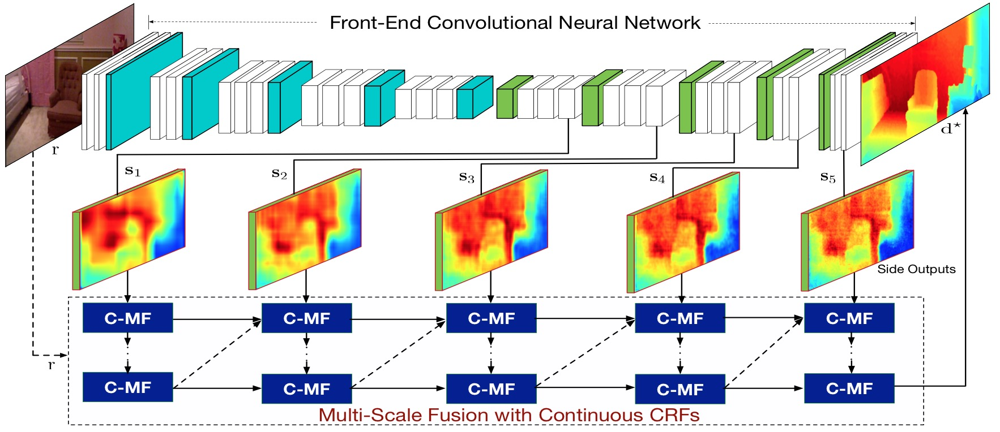

# Multi-Scale Continuous CRFs as Sequential Deep Networks for Monocular Depth Estimation
By Dan Xu, Elisa Ricci, Wanli Ouyang, Xiaogang Wang and Nicu Sebe

  

## Introduction
CCRF-CNN is a continuous CRFs model implemented as neural networks for structured fusion of multi-scale predictions which is applied in monocular depth estimation and was accepted at CVPR 2017.  
The currently published version implements a multi-scale cascade continuous CRF model. The model is implemented as a CNN layer and can be also applicable to other continuous regression problems.  
The code is implemented under Caffe and has been tested under the configurations of Ubuntu 14.04, MATLAB 2015b and CUDA 7.0.
[<a href='https://arxiv.org/pdf/1704.02157.pdf'>PAPER</a>][<a href='https://youtu.be/4mdqh6YGhgE'>ORAL PRESENTATION</a>]
## Trained Model and Deploy file 
To take a practice of our method, please download the trained model and the deploy network file from 
<a href="https://drive.google.com/open?id=0ByWGxNo3TouJRDFPdWF4UWFubVk">Google Drive</a>.
The structured fusion of multiple Scales of the predictions are performed using the developed MultiStageMeanField Caffe layer together with the continuous mean-field updating implementation. The number of mean-field interations could be specified, and the caffe prototxt definition is as follows:
<pre>##Structured fusion of two scales using Continous-CRF-CNN##
layer {
  name: "inference1" # set the name to be the same as in the training phase to 
  load parameters in the testing phase #
  type: "MultiStageMeanfield" bottom: "upscore-map5" bottom: "upscore-map4" bottom: "data" 
  top: "predicted-map1"
  multi_stage_meanfield_param { num_iterations: 6 theta_alpha: 22 theta_beta: 1 theta_gamma: 1 
  spatial_weight: 3 bilateral_weight: 5 } 
  }
  
##Structured fusion of two scales using Continous-CRF-CNN (the output of inference 1 
will be used as an input scale in this phase)##
layer {
  name: "inference2" #if you set name "inference1", code will load parameters from caffemodel#
  type: "MultiStageMeanfield" bottom: "predicted-map1" bottom: "upscore-map3" bottom: "data" 
  top: "predicted-map2"
  multi_stage_meanfield_param { num_iterations: 6 theta_alpha: 22 theta_beta: 1 theta_gamma: 1 
  spatial_weight: 3 bilateral_weight: 5 } 
  }
  
 ... To stack more for fusing more scales ...</pre>
## Citation
Please consider citing our paper if the code is helpful in your research work:
<pre>@inproceedings{xu2017multi,
  title={Multi-Scale Continuous CRFs as Sequential Deep Networks for Monocular Depth Estimation},
  author={Xu, Dan and Ricci, Elisa and Ouyang, Wanli and Wang, Xiaogang and Sebe, Nicu},
  journal={CVPR},
  year={2017}
}</pre>

